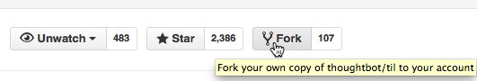
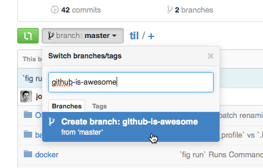
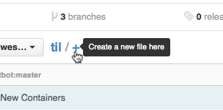
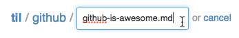
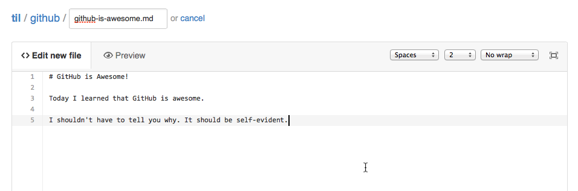
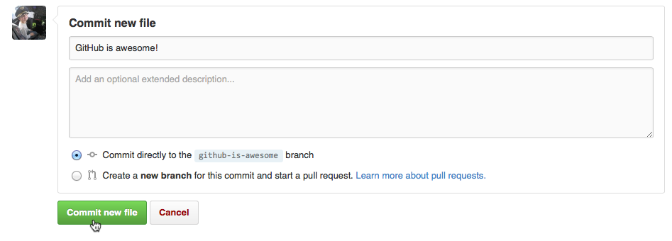
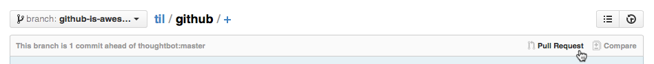
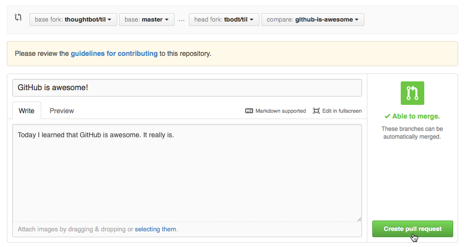

# The GitHub Web Interface

This is a guide to help those unfamiliar with git contribute to the TIL repository.

## Setup
Fork this repository.

## Submitting Changes
 1. Create a branch for your changes. Give it a descriptive name.

    

 2. Add a file for your new TIL.

    

 3. Type the category, a `/`, and the name of your TIL. End with `.md` (for Markdown).

    

    (Note: When you type a `/` in the name box, something (JavaScript magic) automatically separates it as a folder name. Another box appears for the file name.)

 4. Compose your TIL. Make it a work of art.

    

 5. Commit it.

    

 6. Make a pull request.

    
    

    Describe your change in the comment box.

 7. Wait for it to be merged with the main repository.

You just contributed to the TIL repository. Make sure to tell all your friends.
