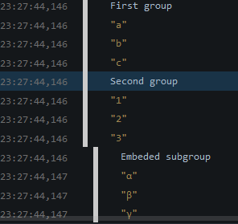
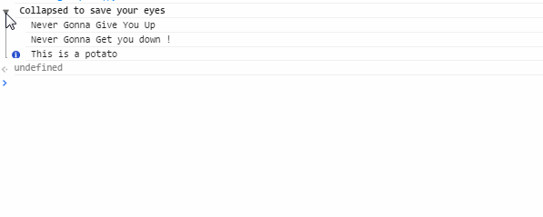

# `console` misknown features.

We've all used the [`console`](https://developer.mozilla.org/en-US/docs/Tools/Web_Console "Console Tool on Firefox") tools
for age (Thank you Firebug) ; but most of use only use the basic features like `console.log()` or `console.error()`.

However, the `console` API is really powerful and offers a lot of very interesting features.

:warning: : Always keep in mind that the `console` API is not standard and is not going to be standardized.
There is absolutely no guarantee that these features will be available and *you should never use `console` on production*.

## String substitutions

`console.log()` and other printing message methods (info, warn and error) supports string substitution (like the C `printf` function).

You can so use :
```javascript
console.log('User %s has %d items', 'John', 5);
```
:arrow_double_down:
```
"User John has 5 items"
```

It's often useful for string concatenation, to avoid the `" + "` agony and prevent the quote/double-quotes errors.

```javascript
var example = " This -> ' and this -> '";
console.log('Here is my string "%s"', example);
```
:arrow_double_down:
```
"Here is my string " This -> ' and this -> '""
```

Currently, here are the supported identifiers :

Identifier  | Description | IE | Chrome | Firefox
:------------- | :------------- | :-------------: | :-------------: | :-------------:
%s | String | :white_check_mark: | :white_check_mark: | :white_check_mark:
%d | Integer | :white_check_mark: | :white_check_mark: | :white_check_mark:
%i | Integer | :white_check_mark: | :white_check_mark: | :white_check_mark:
%f | Floating point value | :white_check_mark: | :white_check_mark: | :white_check_mark:
%o | Javascript object<br>Object will be pretty-printed or a link to the inspector.<br>DOM Object are also handled. | :white_check_mark: | :white_check_mark: | :white_check_mark:
%c | Apply these CSS rules to the following text.<br>Exemple : ```console.log('There are now %c%d%c listeners', 'font-weight: bold;', 2, 'font-weight: normal;')``` =>  There are now **2** listeners  | :x: | :white_check_mark: | :white_check_mark: 
%b | Value as binary | :white_check_mark: | :x: | :x:
%x | Value as hexa decimal | :white_check_mark: | :x: | :x:

## Grouping messages

Messages can be grouped with `console.group()` and `console.groupCollapsed()` and `console.groupEnd()`.

```javascript
console.group('First group');
console.log('a'); console.log('b'); console.log('c');
console.groupEnd();
console.group('Second group');
console.log('1'); console.log('2'); console.log('3');
console.group('Embeded subgroup');
console.log('α'); console.log('β'); console.log('γ');
console.groupEnd(); // For the "Embeded subgroup"
console.groupEnd(); // For the "Second group"
```

:arrow_double_down:



```javascript
console.groupCollapsed('Pre-collapsed to save your eyes');
console.log('Never Gonna %s', 'Give You Up');
console.log('Never Gonna %s', 'Get you down !');
console.info('This is a potato');
console.groupEnd();
```

:arrow_double_down:


